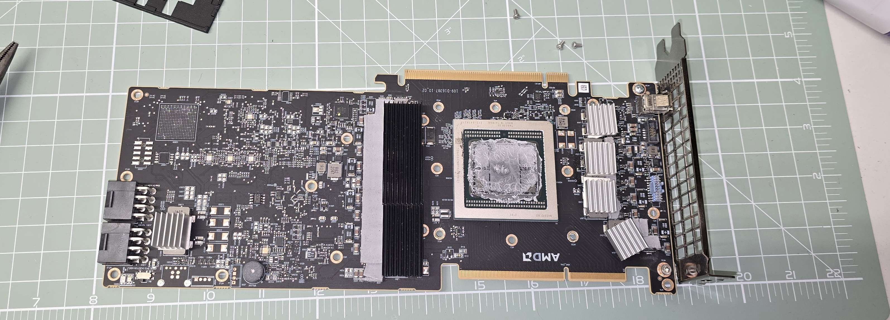

# Repasting and replacing thermal pads on an AMD MI50

<!-- Write your intro here. Example: notes on repasting the GPU and swapping the thermal pads on a used MI50 (Vega 20 / gfx906), with photos of the teardown and the pads used. -->

## Repasted GPU with @MattRX8 3d printed shroud for blower fans. 

You will need blower fans for this mod. 

 Product: BASA0725R2U                                                                                               
                                                                                                                    
 ┌──────────────────────────┬───────────────────────────────────────────────┐                                       
 │ Field                    │ Value                                         │                                       
 ├──────────────────────────┼───────────────────────────────────────────────┤                                       
 │ Type                     │ 4-pin (4-poliger) graphics card fan           │                                       
 ├──────────────────────────┼───────────────────────────────────────────────┤                                       
 │ Part no.                 │ BASA0725R2U                                   │                                       
 ├──────────────────────────┼───────────────────────────────────────────────┤                                       
 │ Voltage                  │ DC 12V                                        │                                       
 ├──────────────────────────┼───────────────────────────────────────────────┤                                       
 │ Current                  │ 1.20 A (~14.4 W)                              │                                       
 ├──────────────────────────┼───────────────────────────────────────────────┤                                       
 │ Marketed compatible with │ AMD Radeon HD 5850, HD 6870, HD 6950, HD 6970 │                                       
 └──────────────────────────┴───────────────────────────────────────────────┘

 Example: https://a.aliexpress.com/_EHJyd4i

<!-- Caption / description for photo 1 -->

## Photo 2

<!-- Caption / description for photo 2 -->

## Photo 3

<!-- Caption / description for photo 3 -->

## Photo 4

<!-- Caption / description for photo 4 -->

<!--
Notes:
- The 4 photos are in the /images folder and embedded above.
- Edit this file on GitHub (or locally) and replace each placeholder comment with your text.
- You can reorder, remove, or add images.
-->
