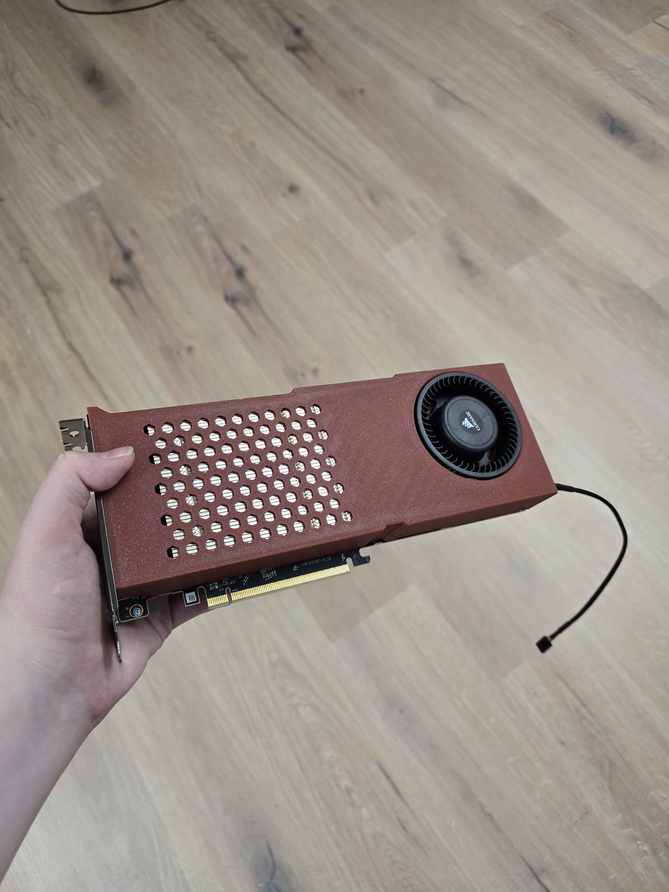
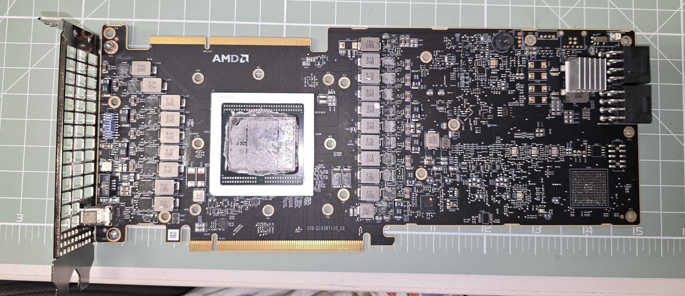
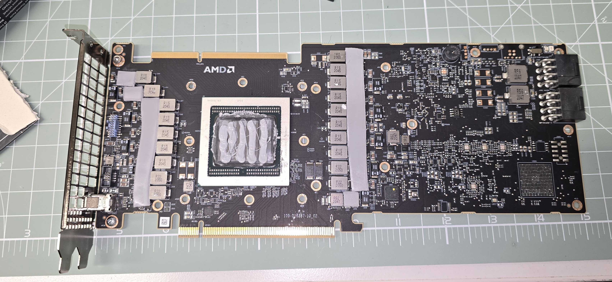

# Repasting and replacing thermal pads on an AMD MI50

Notes on repasting the GPU and swapping the thermal pads on a used MI50 (Vega 20 / gfx906, 32 GiB), with photos of the teardown. The card is fitted with a 3D-printed shroud that takes standard blower fans.

## The shroud

Repasted the GPU and fitted a 3D-printed shroud by **[@MattRX8](https://github.com/MattRX8)** for blower fans. For this mod you'll need the blower fans, a small adapter cable to connect them to the card's fan header, and some mounting screws.

**Blower fan:** BASA0725R2U

| Field | Value |
|---|---|
| Type | 4-pin graphics card fan |
| Part no. | BASA0725R2U |
| Voltage | DC 12 V |
| Current | 1.20 A (~14.4 W) |
| Compatible with | AMD Radeon HD 5850, HD 6870, HD 6950, HD 6970 |

Example: https://a.aliexpress.com/_EHJyd4i

**Fan adapter cable:** The blower fans don't plug straight into the card's PWM header, so you'll need a 4-pin fan adapter/splitter with micro plugs, like this [Sarini 4-pin PWM adapter cable set, 30 cm](https://amzn.eu/d/0cr7AjaK) (3-pack).

**Screws:** 3× M2×4 mm per blower fan.

## Thank you

Big thanks to **MattRX8** ([github.com/MattRX8](https://github.com/MattRX8)) for the 3D-printed shroud. Without his work this build wouldn't have come together.

## What you'll need

- **Thermal paste.** Don't use Thermal Grizzly Kryonaut, it's made for sub-zero overclocking and dries out quickly. Use a thick paste like **Arctic MX-7** instead. **Important:** not all cards are flat with the memory, so you need a thick thermal interface. Best is a phase-change pad like **PTM7950** if you can get one, otherwise you can see hotspot temps of about +40 °C above the median.

For a visual on how thick the paste should be, see this video: https://www.youtube.com/watch?v=4XM-oXvGK7Y

The same should apply to the MI25 and MI60 cards.
- **Thermal pads, 2 mm thick.**

## Photo 1: old paste, no thermal pads

## Photo 2: repasted, with thermal pads added

You won't need more than this.

## Linux fan control

Side note for Linux users. All the blower fans are driven by an **ARCTIC Fan Controller** ([ACFAN00351AB, 10-port with independent per-channel PWM](https://www.arctic.de/en/Fan-Controller/ACFAN00351AB)). Every fan gets its own PWM channel with dedicated power, and the controller is supported by a mainline Linux kernel driver (`arctic_fan_controller`, merged in kernel 7.2 and later), so it shows up as a normal hwmon device with 10 readable RPM and writable PWM channels.

To run a fan curve, use [fan2go](https://github.com/markusressel/fan2go), which reads the GPU temperatures and drives the PWM channels from them. You can also set fan speeds manually through the usual `/sys/class/hwmon/.../pwm*` files.
